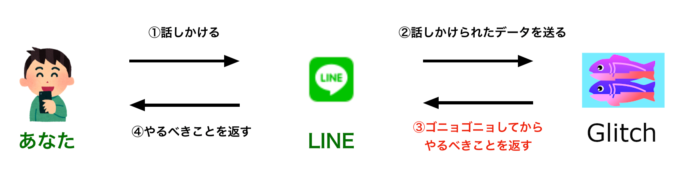

# JCSインターン研修
## 2023年

---

### 今日やること😇

- LINE Botを使ってチャットボットをつくろう💪

---

### チャットボットって何🤔？

- なんか送ったらなんか返してくれるやつ

----

### 例えば

- [LINEで使えるチャットボット15選。トーク画面でピザ注文や再配達依頼ができる！](https://mag.app-liv.jp/archive/64844)

---

### そんな簡単に作れるの🥺？

- つくれます😇

---

### どんなものを作るの😣？

- あなたのやることを教えてくれるチャットボット🤗

---

### どんなものを作るの😣？

- ① やりたいことをあらかじめいくつか入力しておく

- ② チャットボットに「今日何すればいい？」と質問する

- ③ ①で書いたやりたいことのいずれかをBotが返してくれる

---

### 全体のイメージ

---

### Glitchってなに？

- ブラウザで簡単にWebアプリを作れるサービス
- 面倒な環境構築が不要
- 今日はGlitch上でプログラミングします！！

---

## やってみよう！

### 1. LINE Botとともだちになる

----

- ① 別途配布する資料からGlitchにアクセスする

- ② Glitchに登録してあるQRコードをLINEで読み込んで友達登録する

---

### 2. やりたいことを書く

----

- ① createReply.jsを開く

- ② todosの中にやりたいことを書く

----

- これで準備完了！

### . Let's プログラミング！
- 詳細は別資料で👋
