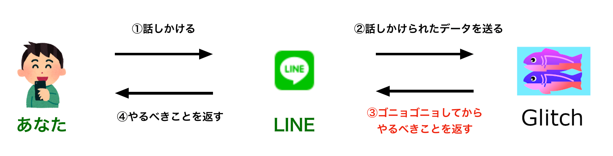
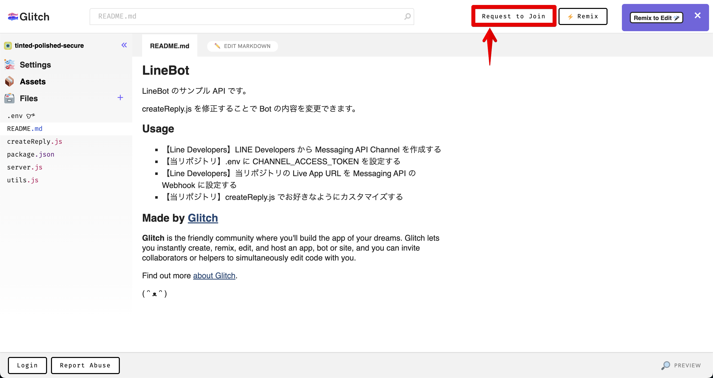

# JCSインターン研修

---

### 今日やること😇

- LINE Botを使ってチャットボットをつくろう💪

---

### チャットボットって何🤔？

- なんか送ったらなんか返してくれるやつ

----

### 例えば

- [三鷹市　ゴミ分別案内チャットBOT](https://www.city.mitaka.lg.jp/chatbot/gomi.html)

---

### そんな簡単に作れるの🥺？

- つくれます😇

---

### どんなものを作るの😣？

- あなたのやることを教えてくれるチャットボット🤗

---

### どんなものを作るの😣？

- ① やりたいことをあらかじめいくつか入力しておく

- ② チャットボットに「今日何すればいい？」と質問する

- ③ ①で書いたやりたいことのいずれかをBotが返してくれる

---

### 全体のイメージ

---

## やってみよう！

----

まずは開発環境を準備します

----

### 開発環境の準備
1. LINE Botとともだちになる
2. Glitchの開発環境を用意する

---

### 1. LINE Botとともだちになる

----

#### 手順
1. 別途配布する資料からQRコードを読み込んで友だち追加する
2. 「リスト」を入力し、メッセージを送信する
3. 「現在の登録内容は、こちら! やりたいこと1,やりたいこと2」と返ってくればOK

---

### 2. Glitchの開発環境を用意する

----

#### 手順

1. 別途配布する資料からGlitchのPJにアクセスする(アカウントがあればログイン頂いても構いません)
2. Request to Join のボタンを押してPJへの参加を要求する

3. 承認後、画面が切り替わらない場合はリロードする

---

これで準備完了！

---

### Let's プログラミング！

練習問題に取り組んでみよう💪